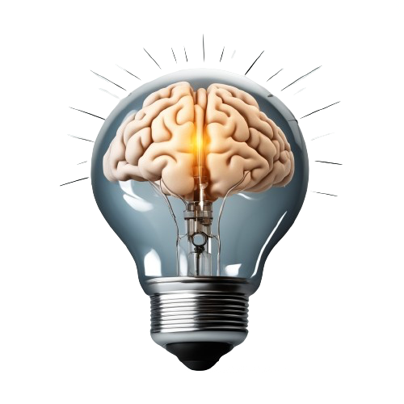
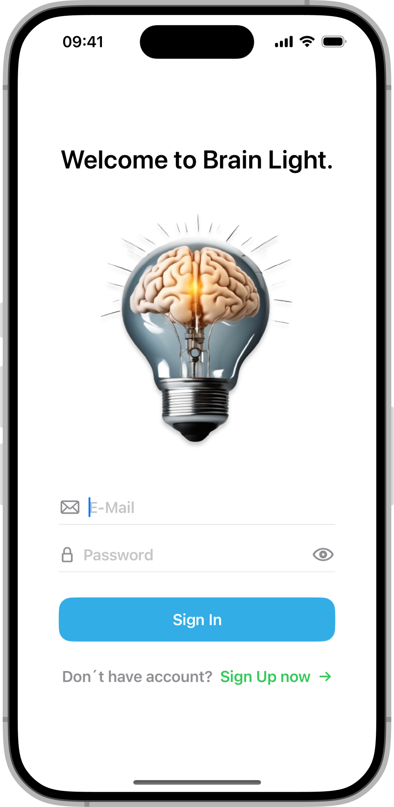
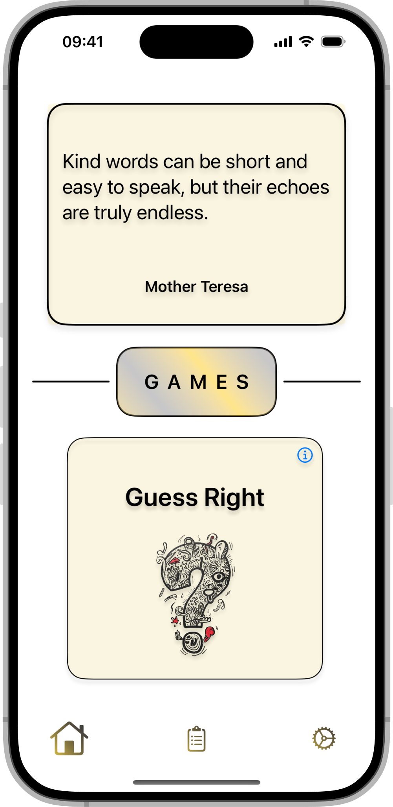
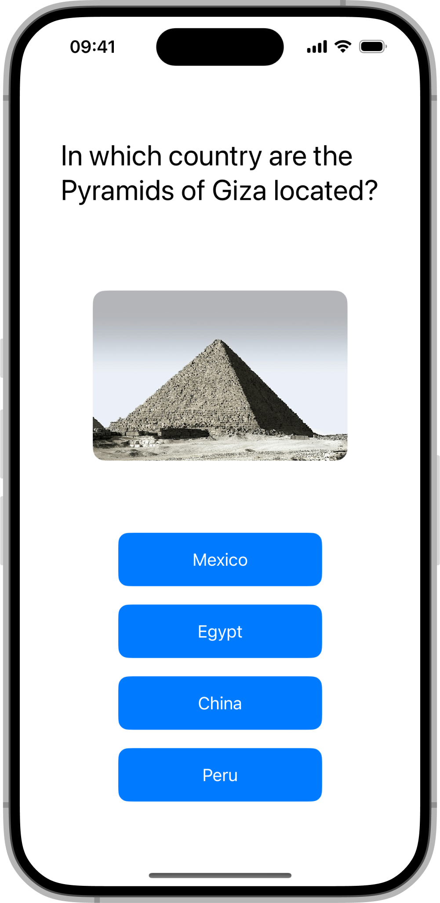
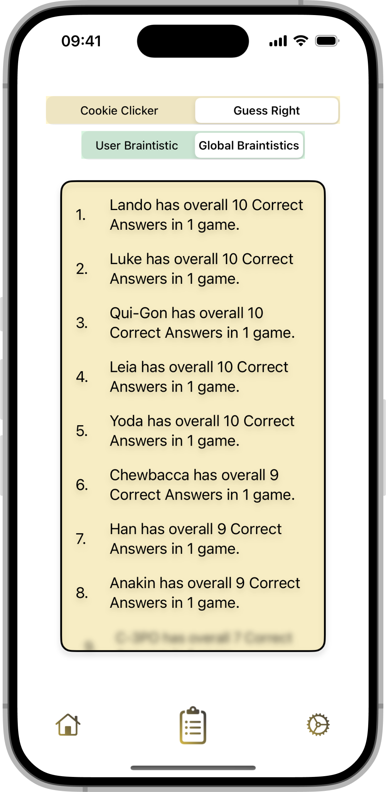

  

# Brain Light

**Brain Light the daily dose of training for your brain.**

Brain Light offers several games with which you can maintain and increase the performance of your brain.

It is particularly suitable for people who have problems with coordination and memory.
Brain Light motivates you every time and encourages you in a playful way with minimal effort and maximum effect.

Due to its simple structure, it is suitable for all age groups.

## Design

  
  
  
  

## Features

- [x] Authentication with Firebase.
- [x] Firestore Database for statistics and advanced statistics.
- [x] Possibility to change username and password.
- [x] Various animations throughout the project.

## Technical Structure

#### Project Structure
The Brain Light app is structured using the MVVM (Model-View-ViewModel) architecture to ensure a clean separation of concerns and enhance testability. The main components are:

*   **Models**: Define the data structures and business logic.
    
*   **Views**: SwiftUI views that render the UI.
    
*   **ViewModels**: Manage the state and handle the logic to update the views.

#### Data Storage

The app uses Firebase for backend services, including:

*   **Authentication**: User authentication and management.
    
*   **Firestore**: Storage of user statistics and advanced statistics. Firestore is chosen for its real-time synchronization capabilities and ease of integration with Firebase Authentication.
    

#### API Calls

The app makes use of the following APIs:

*   **[ZenQuotes API](https://zenquotes.io)**: Fetches random motivational quotes to display in the app.

#### 3rd-Party Frameworks

Brain Light utilizes the [Firebase SDK](https://github.com/firebase/firebase-ios-sdk) for its backend services, including:

*   **Firebase Authentication**: For managing user sign-up, login, and authentication.
    
*   **Firestore**: For real-time database and storage.

## Outlook
Here are some planned features and improvements for the future:

- [ ] Additional games to expand the cognitive training library.
- [ ] Integration with Apple Health for a more comprehensive health overview.
- [ ] Social features for users to compete and share their progress.
- [ ] FaceID and TouchID integration for quick and secure login.
- [ ] Daily reminders and notifications to encourage regular training sessions.
- [ ] Enhanced visual and interactive animations for a more engaging user experience.
- [ ] Customizable user profiles to personalize the training experience.
- [ ] ...

## Sources and Resources

Below are the sources and resources used in the development of this app:

*   **App Icon**: Generated using [DeepAI](https://deepai.org)
    
*   **Images**: Sourced from [Unsplash](https://unsplash.com/de)

*   **API**: [ZenQuotes.io](https://zenquotes.io)
    
*   **Firebase**: [Firebase Official Site](https://firebase.google.com/)
    
*   **Firebase SDK**: [Firebase iOS SDK on GitHub](https://github.com/firebase/firebase-ios-sdk)
    

## Testing the App

If you would like to test the app, please use fake data during registration. If you wish to have your data deleted, please contact me <a href="mailto:malteoppermann@icloud.com">klick hier</a>  with the email address you used to register.

## Authors

*   [@mo5e5](https://github.com/mo5e5)
    

## License

*   [ZenQuotes.io](https://docs.zenquotes.io/terms-and-conditions/)
    
*   [Unsplash](https://unsplash.com/de/lizenz)
